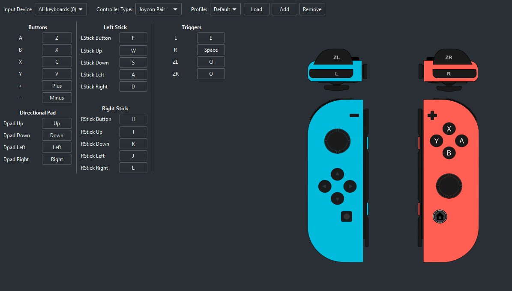

# Mario Kart 8 Deluxe Xbox Controller Controls

### A rust program that allows you use a controller to play mario kart 8 deluxe using an emulator like Yuzu or Ryujinx

## Limitations

### Only works on windows. The keyboard simulation library that I used is windows specific, and I haven't tested the library on any other operating systems.

### Only works for xbox controllers, as far as I know as I have not tested any other types of controllers.

### Requires custom keybind setup on the emulator.

### Does cause lag to the game and operating system, and the controls don't feel immediate, with sometimes roughly a 10+ms delay.

## Setup

### In order for the controller to work properly, you will need to set up your emulators keybinds as the previous image displays.

 

## Controls

### A: Click (Should only be used for UI navigation)

### B: Back (Should only be used for UI navigation)

### Y: Jump/Trick/Drift

### X: Use item

### LB+RB: Start game (When the game asks for you to press LR to start)

### LT: Reverse/Brake

### RT: Accelerate

### Left Stick: Steering and Vertical Controls (Controlling yourself in a glider)

### D-Pad and Right Stick: Directional UI navigation (Should strictly only be used for UI navigation)

 

### And that's it! If you ever want to pause the game, just click anywhere on the screen with your mouse
